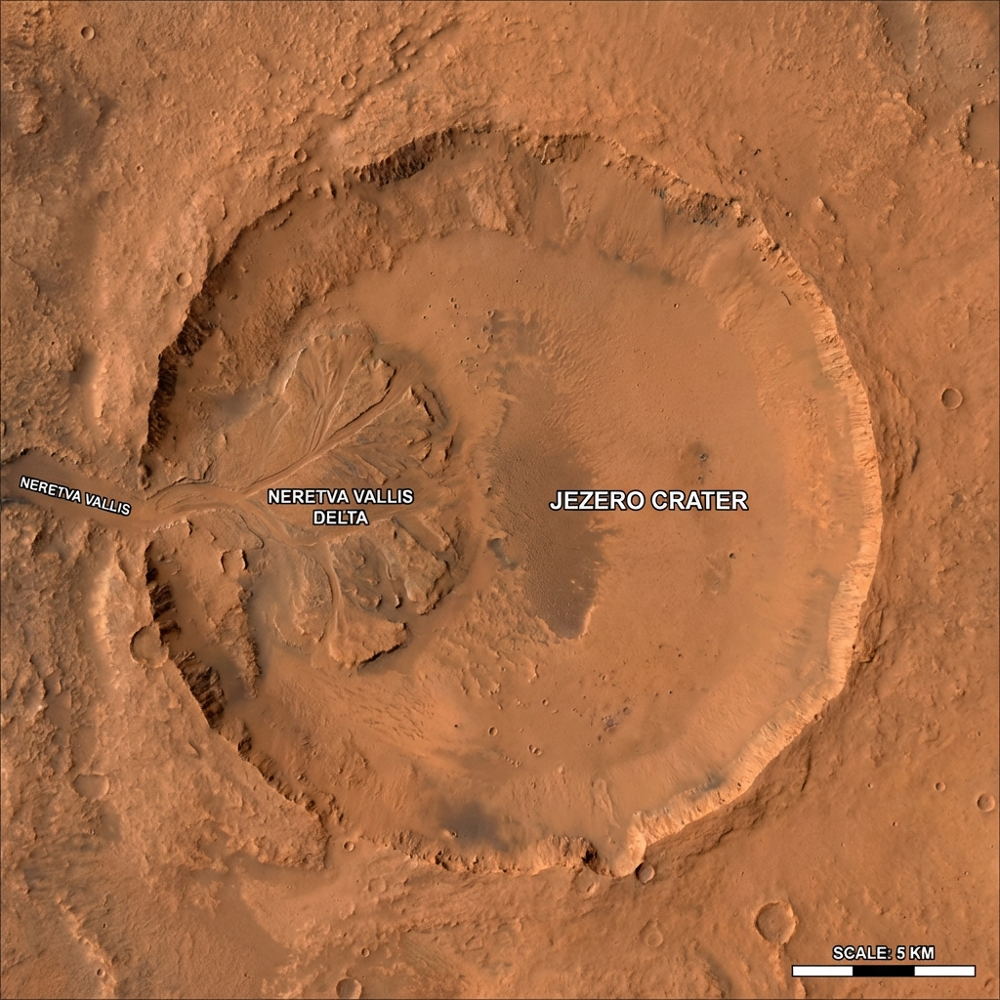

# Projekt Nexus: Analiza kratera Jezero i Automatizacija Navigacije

## A. Izvršni sažetak (Executive Summary)
Ovaj repozitorij sadrži cjelokupnu analitiku i navigacijsku logiku za automatiziranog terenskog robota unutar kratera Jezero na Marsu. Svrha ove analize je obrada sirovih telemetrijskih podataka i geoloških uzoraka kako bi se izradio siguran i automatiziran navigacijski nalog. Uspješnim filtriranjem senzorskog šuma i mapiranjem terena, sustav omogućuje terenskom robotu preciznu orijentaciju i optimalno uzorkovanje tla.

## B. Arhitektura repozitorija
Projekt je organiziran prema strogim inženjerskim standardima kako bi se osigurala modularnost i transparentnost:
* `data/` - Mapa rezervirana za izvorne CSV datoteke s telemetrijom (`mars_lokacije.csv`, `mars_uzorci.csv`).
* `src/` - Mapa koja sadrži isključivo izvorni Python kod za obradu podataka i mrežnu komunikaciju.
* `assets/` - Mapa za pohranu svih generiranih grafičkih prikaza i pozadinskih satelitskih snimaka.
* `README.md` - Središnja dokumentacijska datoteka projekta.

## C. Metodologija obrade podataka (Data Wrangling)
Proces pripreme podataka zahtijevao je primjenu specifičnih logičkih uvjeta na DataFrame objekte kako bi se osigurala pouzdanost analitičkog modela. 
* **Uklanjanje senzorskog šuma:** Identificirane su i eliminirane ekstremne temperaturne vrijednosti koje izlaze izvan operativnih specifikacija opreme. 
* **Sanacija kemijskih anomalija:** Uklonjena su očitanja s nerealnim pH vrijednostima koja su ukazivala na pogrešku u kalibraciji instrumenata.
Ova metodologija je neophodna jer navigacijski algoritmi moraju počivati isključivo na validnim i čistim podacima.

## D. Geoprostorna analiza i vizualizacija
Geoprostorna analiza predstavlja središnji dokaz ispravnosti našeg modela. 

### Korelacija parametara i metan
Donji grafikon prikazuje rasprostranjenost metana u ovisnosti o dubini bušenja. Ovi rezultati su nam omogućili prepoznavanje geološki najperspektivnijih zona za slanje robota.

.jpg)

### Satelitsko mapiranje terena
Završna mapa koristi tehnički koncept *extent* mapiranja granica. Pomoću ovog koncepta, raspršeni podaci s telemetrijskih senzora kontekstualno su pozicionirani na stvarne GPS koordinate kratera Jezero preko satelitske snimke visoke rezolucije. To je presudno za pouzdanu orijentaciju i planiranje putanje robota.



## E. Komunikacijski protokol (JSON Uplink)
Prijenos instrukcija prema robotskom modulu vrši se putem standardiziranog mrežnog paketa. Kako bismo izbjegli ručno kodiranje (hardcoding), primijenili smo Python petlje za iterativno čitanje izračunatih koordinata i automatizirano generiranje naredbi.

Primjer ugniježđene strukture našeg JSON niza:
```json
{
  "mission_id": "NEXUS-01",
  "rover_commands": [
    {
      "action": "move",
      "target_coordinates": {"lat": 18.444, "lon": 77.451},
      "speed": "moderate"
    },
    {
      "action": "drill",
      "depth_cm": 15.5
    }
  ]
}
